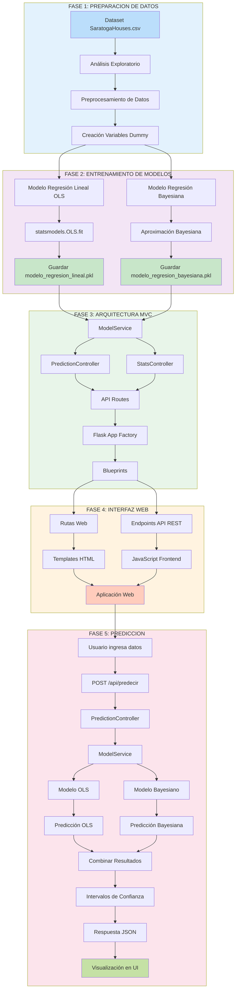

# Diagrama de Desarrollo del Proyecto

Diagrama explicativo del desarrollo y arquitectura del sistema de predicción de precios de casas para exposición académica.

## Descripción del Desarrollo

### Fase 1: Preparación de Datos
Se carga el dataset SaratogaHouses.csv, se realiza análisis exploratorio y preprocesamiento de datos, incluyendo la creación de variables dummy para características categóricas.

### Fase 2: Entrenamiento de Modelos
Se entrenan dos modelos estadísticos complementarios:
- **Modelo OLS**: Regresión lineal múltiple usando mínimos cuadrados ordinarios
- **Modelo Bayesiano**: Regresión con inferencia bayesiana usando el Teorema de Bayes

Ambos modelos se guardan como archivos .pkl para su posterior uso.

### Fase 3: Arquitectura MVC
Se implementa una arquitectura Model-View-Controller limpia:
- **Services**: ModelService y StatsService encapsulan la lógica de dominio
- **Controllers**: PredictionController y StatsController orquestan la lógica de negocio
- **Routes**: Blueprints organizan los endpoints de la API y rutas web
- **Factory Pattern**: Flask App Factory permite configuración flexible

### Fase 4: Interfaz Web
Se desarrolla la interfaz de usuario con:
- Templates HTML para la presentación
- JavaScript para la interacción del cliente
- Endpoints API REST para la comunicación backend-frontend
- Bootstrap para el diseño responsive

### Fase 5: Predicción
Flujo completo de predicción:
1. Usuario ingresa datos de la casa
2. Frontend envía petición POST a la API
3. Backend procesa con ambos modelos en paralelo
4. Se combinan resultados y se calculan intervalos de confianza
5. Se retorna respuesta JSON con predicciones
6. Frontend visualiza resultados al usuario

## Tecnologías Utilizadas

- **Backend**: Flask 3.0, Python 3.10
- **Modelos Estadísticos**: statsmodels, scipy
- **Análisis de Datos**: pandas, numpy
- **Frontend**: HTML5, JavaScript, Bootstrap 5
- **Arquitectura**: MVC, Factory Pattern, Blueprints
